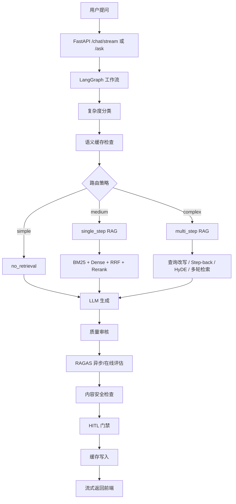

# Adaptive RAG 企业文档问答系统

面向企业文档问答场景的自适应 RAG 系统。项目以 **FastAPI + LangGraph + ChromaDB + Next.js** 为主体，支持文档上传、结构感知分块、混合检索、云端向量化（embedding）/重排（rerank）、流式问答、RAGAS 对比评估、Langfuse 全链路追踪和 HITL 人工审核。

> 部署者需要自己在 `.env` 中填写 LLM、向量模型、重排模型、RAGAS 或 Langfuse 的 API key。本仓库只提交 `.env.example`，不提交任何真实密钥。

## 核心特性

- **独立前后端架构**：FastAPI 提供 API，Next.js 提供问答、文档、评估、诊断页面。
- **自适应 RAG 路由**：基于 LangGraph 将问题动态路由到 `no_retrieval`、`single_step`、`multi_step`。
- **上传文档范围隔离**：前端上传文档后，后续问答默认只在当前会话（session）的已上传文档中检索，避免跨文档污染。
- **结构感知分块**：根据文件类型、文档结构、标题密度、表格/代码比例自动选择分块策略。
- **混合检索链路**：BM25 关键词召回 + 稠密向量召回 + RRF 融合 + qwen3-rerank 精排。
- **数值问答增强**：对预算、支出、剩余、合计、最大/最小等问题优先使用结构化计算，减少 LLM 数值幻觉。
- **质量闭环**：包含 reviewer、RAGAS、内容安全检查、HITL 队列和语义缓存。
- **可复现部署**：提供 Dockerfile、docker-compose、中文部署文档和可演示样例。

## 技术栈

| 模块 | 技术 |
| --- | --- |
| API 服务 | FastAPI, Uvicorn |
| 工作流编排 | LangGraph |
| LLM 接入 | LangChain, langchain-openai, OpenAI 兼容 API |
| 向量库 | ChromaDB |
| 向量模型 | DashScope `text-embedding-v4`，兼容 OpenAI embeddings 接口 |
| 重排模型 | DashScope `qwen3-rerank` |
| 关键词检索 | rank-bm25 |
| 文档解析 | PyMuPDF, python-docx, docx2txt, markdown, pandas, unstructured |
| 评估 | RAGAS, datasets |
| 可观测性 | Langfuse 4.x, OpenTelemetry |
| 前端 | Next.js 14, React 18, TypeScript, Tailwind CSS |

## 系统流程



## 目录结构

```text
adaptive-rag-system/
├── api/                 # FastAPI 路由、API 数据结构、SSE 与追踪辅助
├── cli/                 # 命令行辅助工具
├── config/              # 配置与提示词模板
├── data/                # 示例数据与运行时数据目录
├── docs/                # 部署、演示、工程说明、评估说明
├── frontend/            # Next.js 前端
├── samples/             # 可公开演示的样例文档和问题
├── src/                 # RAG 核心实现
├── tests/               # 单元测试与回归测试
├── Dockerfile.backend
├── Dockerfile.frontend
└── docker-compose.yml
```

## 快速启动

### Docker 启动

```bash
copy .env.example .env
# 编辑 .env，填写至少 LLM_API_KEY、EMBEDDING_API_KEY、RERANK_API_KEY

docker compose up --build
```

访问地址：

- 前端：<http://localhost:3001>
- 后端健康检查：<http://localhost:8000/health>
- 后端接口文档：<http://localhost:8000/docs>

### 本地启动

```bash
python -m venv .venv
.venv\Scripts\activate
pip install -r requirements.txt
copy .env.example .env
python main.py serve
```

另开一个终端启动前端：

```bash
cd frontend
npm ci
npm run dev
```

## API Key 说明

别人部署这个项目时必须填写自己的 API key。推荐做法是复制 `.env.example` 为 `.env`，然后填写：

- `LLM_API_KEY`：聊天模型 key。
- `LLM_BASE_URL`：OpenAI 兼容聊天补全接口地址。
- `EMBEDDING_API_KEY` 或 `DASHSCOPE_API_KEY`：向量模型 key。
- `RERANK_API_KEY` 或 `DASHSCOPE_API_KEY`：重排模型 key。
- `RAGAS_EVAL_API_KEY`：仅在启用 RAGAS 在线评估时需要。
- `LANGFUSE_PUBLIC_KEY` / `LANGFUSE_SECRET_KEY`：仅在启用 Langfuse 追踪时需要。

默认 `.env.example` 将 Langfuse 和 RAGAS 在线评估设为关闭，方便新部署先跑通主流程。

## 演示路径

1. 启动前后端。
2. 打开 `/documents`。
3. 上传 `samples/demo_report.md`。
4. 使用 `samples/demo_questions.md` 中的问题测试事实查询、列表聚合、数值聚合、隐含推断和不可回答边界。
5. 打开 `/evaluation` 对比直接回答 / 标准 RAG / 自适应 RAG。
6. 打开 `/diagnostics` 查看服务状态、token 计数和性能摘要。

## 常用命令

```bash
python main.py ask "这份文档中有几个项目？"
python main.py chat
python main.py ingest samples/demo_report.md
python main.py eval "天枢客户助手的预算是多少？"
python -m pytest tests/ -v
```

前端构建：

```bash
cd frontend
npm run build
```

## 数据与安全

不要提交以下内容：

```text
.env
data/chroma/
data/sqlite/
data/hitl_queue/
data/hitl_results/
data/ltm_chroma/
frontend/node_modules/
frontend/.next/
*.log
个人简历或真实公司内部资料
```

当前仓库保留的是可公开演示的合成样例，不包含真实密钥。

## 面试讲解重点

- 这个项目不是简单提示词包装，而是包含摄入、索引、检索、重排、工作流路由、评估、可观测性和前端交互的完整链路。
- 自适应路由避免所有问题都走最贵的多步检索路径。
- 会话/文档过滤避免上传文档问答混入历史文档。
- 数值聚合尽量走确定性计算，减少 LLM 自由总结导致的数字幻觉。
- Docker 部署证明项目可以在作者本机之外复现。
